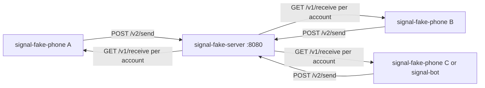

# Fake Signal multi-instance playground

## Goal

Local playground with **no real phone numbers**: one shared fake network, multiple “phone” processes that DM/group-chat each other, and the option to run `signal-bot` against the same API.

## Approach (committed)

Build a new workspace crate **`crates/signal-fake`** that:

1. Serves an in-memory **signal-cli-rest-api-compatible** HTTP surface on `:8080`
2. Ships a **`signal-fake-phone`** interactive CLI (one process = one account; open three terminals)
3. Adds a Compose overlay that **replaces** the real `signal-api` service with the fake server (same DNS name so env vars stay valid)

This is **not** a Signal protocol mock. It is a shared message bus shaped like the REST API [`signal-client`](../../crates/signal-client/src/client.rs) already calls (HTTP poll only — no WebSocket).



## Runtime model

- **Accounts:** Instant “register” with any E.164 string (no captcha/SMS). Stored in memory (optional JSON seed file for reboot).
- **DM send:** `POST /v2/send` with `number` = sender, `recipients: ["+1…"]` enqueues an `IncomingMessage` on the recipient’s inbox.
- **Receive:** `GET /v1/receive/{phone}` **dequeues** that account’s inbox (empty → `[]`), matching how the bot’s `MessageReceiver` polls.
- **Groups:** Create/list/add/remove/join/rename with both `id` (`group.…`) and `internal_id` (what appears in `groupInfo.groupId` on receive). Group sends fan out to all members except sender.
- **Attachments (MVP):** In-memory blob store; `GET /v1/attachments/{id}` returns bytes. Phone CLI can skip voice initially; stubs keep voice tests/bot happy later.

## REST surface (MVP — match client usage)

Minimum for boot + chat + Language Threads basics (from [`client.rs`](../../crates/signal-client/src/client.rs)):

| Endpoint | Behavior |
|----------|----------|
| `GET /v1/health` | 204 |
| `GET /v1/accounts` | Registered numbers |
| `GET /v1/accounts/{phone}` | `{number, uuid, registered}` |
| `POST /v1/register/{phone}` | Instant register (ignore captcha body) |
| `GET /v1/receive/{phone}` | Dequeue inbox |
| `POST /v2/send` | Route DM or `group.*` |
| `GET/POST /v1/groups/{phone}` | List / create |
| `POST/DELETE …/members`, `PUT …`, `POST …/join` | Group mutations |
| `GET /v1/attachments/{id}` | Raw bytes |

Out of scope for v1: real Signal crypto, registration-proxy rate limits, identities/trust beyond stub 200, profile/username APIs.

Payload shapes reuse existing fixtures under [`docs/spikes/fixtures/`](../spikes/fixtures/) and types in [`crates/signal-client/src/types.rs`](../../crates/signal-client/src/types.rs).

## Binaries / UX

### `signal-fake-server`

```bash
cargo run -p signal-fake --bin signal-fake-server -- --listen 0.0.0.0:8080
# optional: --seed docker/fake-signal-seed.json
```

Seed example: three numbers `+15550000001`…`003`, one group “Playground” with all three members.

### `signal-fake-phone` (multi-instance)

One terminal per account:

```bash
cargo run -p signal-fake --bin signal-fake-phone -- \
  --api http://127.0.0.1:8080 --number +15550000001
```

REPL commands (text-first):

- bare text → send DM to `--peer` (or last peer)
- `/to +1555…` — set peer
- `/group group.…` — send to group
- `/create-group Name +1555… +1555…`
- `/accounts`, `/groups`, `/help`
- background poll thread prints inbound messages as they arrive

Opening three instances = three REPLs against one server = back-and-forth without phones.

## Compose integration

New overlay [`docker/compose.fake.yaml`](../../docker/compose.fake.yaml):

- Replace `signal-api` with a build of `signal-fake-server` (or `cargo` image), listen **8080**, keep service name **`signal-api`**
- Publish `8080:8080` so host phones can attach
- Drop `signal-config-translation` volume requirement for this service
- Document: do **not** use this overlay against prod CVM / real volumes
- Keep `signal-bot` optional: when present, set `SIGNAL__PHONE_NUMBER` to one seeded account (e.g. `+15550000003`); still needs `NEAR_AI_API_KEY` for real LLM/Whisper

Usage:

```bash
docker compose -f docker/compose.yaml -f docker/compose.fake.yaml --env-file docker/.env up -d signal-api
# then run 2–3 signal-fake-phone processes on the host
```

## Tests

- Unit tests inside `signal-fake`: register → A sends to B → B receive returns envelope once; group fan-out; receive empties queue
- One thin integration test: `SignalClient` + `MessageReceiver` against the fake server (reuse real client, not wiremock) proving round-trip

## Docs

Short guide [`docs/local-dev/fake-signal.md`](../local-dev/fake-signal.md): start server, seed three accounts, open three phones, optional bot attach. Link from [`docs/local-dev/README.md`](../local-dev/README.md).

## Non-goals (explicit)

- Replacing wiremock in existing unit tests (keep those; fake is for multi-party playground / optional live client tests)
- Full registration-proxy parity
- Shipping fake Signal on Phala / prod

## Key files to add/touch

- **Add** `crates/signal-fake/` (lib: store + axum routes; bins: server + phone)
- **Edit** root [`Cargo.toml`](../../Cargo.toml) workspace members
- **Add** `docker/compose.fake.yaml` (+ tiny Dockerfile or reuse workspace build if practical)
- **Add** `docs/local-dev/fake-signal.md` + link from local-dev README

## Implementation checklist

- [ ] Add `crates/signal-fake`: in-memory store + axum REST subset (health, accounts, register, receive, send, groups, attachments)
- [ ] Add `signal-fake-server` and `signal-fake-phone` (REPL + poll) binaries with seed file support
- [ ] Round-trip unit tests + `SignalClient`/`MessageReceiver` integration against fake server
- [ ] Add `docker/compose.fake.yaml` and `docs/local-dev/fake-signal.md`; link from local-dev README
