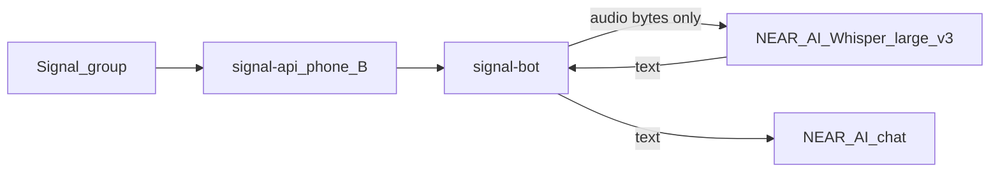

# One CVM, one Signal number

Prod runs hub, translation, and voice on **one** Phala CVM as **one** Signal member (the surviving translation number, phone B). Users add **one** bot to a group. STT is remote **NEAR AI Whisper Large V3**; after a transcript, in-chat and Language Threads fan out **in-process** (Signal does not echo this bot’s own posts).

See also: [issue #10](https://github.com/BreadchainCoop/sigstack-bot/issues/10) and the architecture learning [CPU TEE Whisper does not scale](solutions/architecture-patterns/2026-08-13-cpu-tee-whisper-does-not-scale.md).

## Bot

| Bot | Phone | Duty |
|-----|-------|------|
| **Bread Bot** | Registered number on this CVM | Hub menus (`!help`, `!info`, `!privacy`), Language Threads, Bilingual Threads, in-chat translation, voice (`!transcription` menu, `!transcribe*`), `!verify` (one reply) |

Voice crate [`crates/signal-bot-voice`](../crates/signal-bot-voice); pairing / `PEER_PHONE` / a second Signal number do not exist.

## Diagram



## Rules

- **One phone number**, one bot in the group. Auto-accepts invites (`AcceptAll`).
- No local Whisper sidecar. Voice audio is decrypted in this TEE, stripped of Signal metadata, and sent to **NEAR AI Whisper Large V3** (GPU TEE). Translation text uses the same vendor.
- Per-message `tokio::spawn` so an STT wait cannot stall other handlers in the same process.
- After STT, fan out spoken text in-process so in-chat auto, Language Threads, and Bilingual Threads still see transcripts.
- Same `signal-bot` image (Whisper + NEAR required).
- Do not reintroduce `whisper-api` or put Whisper on a larger CPU TEE as the scale path.

## Local stack

```bash
cp docker/env.example docker/env
# Set SIGNAL_PHONE; NEAR_AI_API_KEY (chat + Whisper STT)

docker compose -f docker/compose.yaml --env-file docker/env up -d
```

Register the number against this stack’s `signal-api` (or the registration proxy on host port `8081`).

## Phala (prod)

| Compose | CVM | Contents |
|---------|-----|----------|
| [`docker/phala.yaml`](../docker/phala.yaml) | 4 GB (`tdx.medium`) | `signal-api` + `signal-bot` + proxy `:8081`. **No Whisper sidecar.** |

Live CVM: `sigstack-translation` **`0e82fa77-8b15-4dbd-89c4-9045ab911353`** (app `9adac7636fe255182f699940ffd1924960415507`). The former transcription CVM `eba19afc-0c26-4409-b026-f757928d2ef8` was deleted (idle Whisper bill). The retired second number is not re-registered; groups that still list it can remove that contact.

Upgrade **in place** only:

```bash
phala deploy --cvm-id 0e82fa77-8b15-4dbd-89c4-9045ab911353 \
  -c docker/phala.yaml -e docker/phala.env --wait
```

[`scripts/deploy_phala.sh`](../scripts/deploy_phala.sh) defaults to that `--cvm-id`. Do not `phala deploy -n` against the live CVM.

### CVM storage (keep intact)

The suite stays cohesive only if the live CVM keeps disk state. **TEE RAM is wiped** on every restart or upgrade; that is expected. User prefs and Signal identity are **not** in RAM — they live on named Docker volumes that Phala reattaches on an in-place upgrade.

| Volume | Compose | What it holds | If wiped |
|--------|---------|---------------|----------|
| `signal-config-translation` | `signal-api` (phone B) | Bot **registered Signal phone** | Bot disappears from Signal until ops re-register |
| `group-prefs-translation` | `signal-bot` → `/data/group_prefs.enc` | Encrypted prefs: `!translate-me-on`, `!translate-all-on`, Language Threads bridges, menu language | Users must re-enable features |
| `registry-data` | registration proxy | Ops registration helper state | Re-register via proxy; does not by itself drop Signal CLI |

Do **not** rename `signal-config-translation` / `group-prefs-translation` / `registry-data`. Do not migrate `group-prefs-transcription` (`!transcribe-on` default off is the product). Unused transcription volumes from the old two-phone compose may remain on disk; they are not attached.

**Upgrade the live CVM in place** (`phala deploy --cvm-id 0e82fa77-8b15-4dbd-89c4-9045ab911353` or the dashboard compose update). Do **not** create a replacement CVM or `down -v` for a routine image bump. First bring-up of a **new** CVM is the exception (empty volumes; register the phone there).

| Event | Volumes | Users re-enable prefs? | Re-register phone? |
|-------|---------|------------------------|---------------------|
| In-place CVM upgrade (`--cvm-id`) | Kept (Phala reattaches) | No | No |
| Container / CVM restart, same compose | Kept | No | No |
| New CVM / `phala cvms delete` / volume rename | Empty | Yes | Yes |
| Prefs decrypt fail (key mismatch) | File present, unreadable | Yes (bot starts empty) | No (Signal volume is separate) |

Prefs are encrypted with dstack `DeriveKey` (path `signal-bot/group-preferences`), bound to the CVM **app id**, so a compose/image change should still decrypt. If DeriveKey is unavailable the AppInfo fallback includes `compose_hash` — a compose change then fails decrypt. After upgrade, logs should show `Loaded group preferences for N groups`, not `starting fresh` or `TEE deployment may have changed`. Confirm Signal accounts still listed on `signal-api`.

Do not change volume names in [`docker/phala.yaml`](../docker/phala.yaml) without a deliberate migration.

## Products on this CVM

| Product | Process | Doc |
|---------|---------|-----|
| Voice transcription | Same `signal-bot` | [voice-transcription.md](voice-transcription.md) |
| In-chat (group) translation | Same `signal-bot` | [in-chat-translation.md](in-chat-translation.md) |
| Language Threads | Same `signal-bot` | [language-threads.md](language-threads.md) |
| Bilingual Threads | Same `signal-bot` | [bilingual-threads.md](bilingual-threads.md) |

### Interoperability

- **Voice** quote-replies `📝 Transcript:` then fans out spoken text to in-chat / Language Threads / Bilingual Threads as the **original speaker** (not the bot).
- **In-chat** translates inside one group thread (quote-reply). Bot translation replies are not re-translated.
- **Language Threads** bridges a multilingual main to N monolingual sidecars (`!translate-me-thread <lang>`).
- **Bilingual Threads** assigns a language to main and to one sidecar and translates both ways (`!translate-me-thread es en`). Mutually exclusive with Language Threads and in-chat auto.

## Why one process (not two phones)

Two **processes** used to keep translation off the STT wait, with two Signal numbers so the translation bot could *see* transcripts as another member’s posts. One number does not receive its own group sends, so transcripts must fan out in-process. Per-message `tokio::spawn` replaces the second process for latency isolation. Do not re-home Whisper in this CVM.
