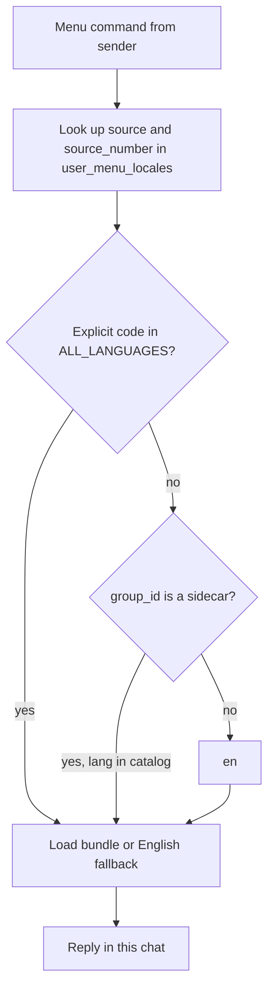

# Localize Bot Menus - Plan

## Goal Capsule

- **Objective:** Users pick a menu language with `!set-lang`. Every `ALL_LANGUAGES` code is a valid choice. Menus render in that language when a bundle exists, otherwise English. Mobile stacked layout stays intact.
- **Authority:** This plan. Product behavior lives on R-IDs. Mechanism lives on KTDs. Issue 27 is origin, not a second spec.
- **Stop if:** The work would wipe or replace CVM volumes, call NEAR to translate menus at runtime, grow `MenuLanguage` with one variant per language, or localize command tokens.
- **Execution profile:** Test-first on storage, resolver, and `!set-lang`. Spanish copy lands after the English fallback path is proven.
- **Tail:** Docs in U6. In-place Phala deploy only. Compound a solutions note after ship.

---

## Product Contract

### Summary

Bot menus are English-only static strings in `crates/signal-bot/src/commands/menu_locale.rs`. Translation already covers ~30 `ALL_LANGUAGES` codes. Users need a Signal-text picker so menus can follow their language without a new Rust enum per code.

This plan ships the picker, per-user persistence, English fallback for every catalog code, and one complete non-English bundle (Spanish). Pairing copy is already gone. Transcription and translation live on one bot.

### Problem Frame

A Spanish speaker in a mixed group still gets English `!help`. The leftover `MenuLanguage` enum is per-group and only `en`/`es`. Handlers do not read it. `!help` also works in DMs, which have no group id. Per-group storage cannot satisfy mixed groups or DMs.

### Requirements

**Locale model**

- R1. Menu locale is per user, shared across DMs and groups for that Signal identity.
- R2. Every `ALL_LANGUAGES` code is a valid menu-locale choice without a new enum variant.
- R3. Missing locale or missing string falls back to English. Menu commands never fail for lack of a bundle.
- R4. Command tokens stay English (`!help`, `!translate-me-on`, and the rest). Only titles, section headers, descriptions, guides, and confirmations translate.

**Selection UX**

- R5. Bare `!set-lang` lists flags, autonyms, and codes for all `ALL_LANGUAGES` entries.
- R6. `!set-lang <code-or-name>` persists that user's locale and confirms. Extra tokens after the language are rejected. Unknown languages are rejected with a pointer to `!list-langs` / `!set-lang`.
- R7. Hub `!help` and `!info` list `!set-lang` with a short multilingual gloss so a non-English speaker can find the picker from the default English hub.
- R8. `!list-langs` stays the translation-target catalog. It adds a one-line cross-link to `!set-lang`.

**Rendering**

- R9. After a locale is set, hub `!help`, hub `!info`, sidecar `!commands`, sidecar `!info`, product menus, feature guides, the `!translation` redirect, and `!privacy` use that locale (or English fallback).
- R10. In a Language Thread sidecar, if the user has no explicit locale, menus default to that sidecar's language code when it is in `ALL_LANGUAGES`.
- R11. An explicit user locale wins over the sidecar default, including `en`.
- R12. Localized command lists keep the stacked layout in `docs/solutions/signal-mobile-menus.md`.
- R13. Hub `!help` from a sidecar still returns the Bread Bot hub menu (localized), not the thread compact list.

**Coverage and persistence**

- R14. English bundles are complete. Spanish is the first full non-English bundle, including `!privacy` after a human attestation-copy check. Other codes persist and render English until a bundle is added.
- R15. Locale survives bot restart via the existing encrypted prefs file. Deploy is in-place on the live CVM. Volumes are not wiped.

### Actors

- A1. Group member (main chat).
- A2. DM user (no `group_id`).
- A3. Language Thread sidecar member.

### Key Flows

- F1. Discover and set
  - **Trigger:** A1 or A2 sends `!help`, then `!set-lang` or `!set-lang es`.
  - **Actors:** A1, A2
  - **Covered by:** R5, R6, R7
  - **Outcome:** Locale persisted. Confirmation in Spanish if the ES bundle exists, else English naming the language.
- F2. Mixed-language group
  - **Trigger:** A has locale `es`, B has default/`en`. Each sends `!help` in the same group.
  - **Covered by:** R1, R9
  - **Outcome:** A's reply is Spanish. B's reply is English.
- F3. Sidecar default
  - **Trigger:** A3 has no explicit locale and sends `!commands` in an `es` sidecar.
  - **Covered by:** R10, R11
  - **Outcome:** Spanish thread menu. After `!set-lang en`, the same sidecar shows English.
- F4. Restart
  - **Trigger:** User set a locale. Bot restarts with the same prefs volume.
  - **Covered by:** R15
  - **Outcome:** Next `!help` still uses that locale.

### Acceptance Examples

- AE1. Covers R6, R9. Given a user sends `!set-lang es` (or `español`). When they send `!help`. Then the hub title/section copy is Spanish and `!translation-threads` is still present on its own line.
- AE2. Covers R6. Given `!set-lang klingon` or `!set-lang es en`. Then the bot rejects and does not persist.
- AE3. Covers R3, R14. Given `!set-lang fr` with no French bundle. Then confirmation names French. Later menus are English.
- AE4. Covers F2. Given A=`es` and B unset in one group. Then each `!help` matches that sender.
- AE5. Covers R10. Given no user pref in an `it` sidecar. Then `!commands` uses Italian if bundled, else English (same fallback as any missing bundle).
- AE6. Covers R1. Given the user sets locale in a DM. When they send `!help` in a group. Then the group reply uses the same locale (dual identity keys).

### Success Criteria

- `!set-lang` is registered. `handlers_setup` no longer asserts its absence.
- All `ALL_LANGUAGES` codes can be selected. Unbundled codes fall back to English.
- Spanish `!help` and `!privacy` exist and keep stacked layout / attestation scope.
- Encrypted round-trip keeps the per-user map. Legacy snapshots without the field still load.
- `docs/solutions/signal-mobile-menus.md` no longer says menus are English-only.

### Scope Boundaries

**In scope**

- Menu, guide, picker, and `!set-lang` confirmation copy.
- Per-user locale on the encrypted store.
- Spanish as the proof locale.

**Deferred to follow-up**

- Bundles for the remaining `ALL_LANGUAGES` codes (mechanism in this plan; copy later).
- Localizing operational errors (`Unknown language`, `NOT_THREAD_MSG`, translate on/off confirmations).
- `!set-lang auto` to clear an explicit pref and restore sidecar default.
- Offline generate-from-English script.
- Special RTL markup for `ar` / `he`.

**Outside this product**

- Translating user message content (existing translation paths).
- Reviving transcription pairing / second phone.
- Runtime LLM translation of UI.
- fluent / gettext or a new i18n crate.
- Wiping or replacing the live CVM / prefs volume.

### Product Contract preservation

Product Contract authored in this plan (`ce-plan-bootstrap`). Issue 27 open questions are closed here. Sidecar compact menu is `!commands`, not hub `!help`. Pairing messages are out because they are gone. `!privacy` is one-bot copy, not two roles.

---

## Planning Contract

### Key Technical Decisions

- KTD1. Store locales in a snapshot-level `user_menu_locales: HashMap<String, String>` (user key → ISO code), not on `GroupPreference`.
  (session-settled: user-approved — chosen over per-group `MenuLanguage` and over a map nested in each group: DMs have no group id; mixed groups must not share one menu language)
  Governs R1, R15.
- KTD2. Dual-write and dual-read `message.source` and `message.source_number` when they differ, matching `translate_all.rs`.
  Governs AE6.
- KTD3. Keep `menu_language: MenuLanguage` on `GroupPreference` for old snapshot serde. Do not read it for UI. Do not backfill `Es` onto users. Do not bump `DATA_VERSION`.
  Governs R15.
- KTD4. `menu_locale` functions take a locale code and return `&'static str`. English is the complete source. Missing locale or key uses English. No fluent/gettext. No NEAR call for menus.
  (session-settled: user-approved — chosen over runtime LLM translation and over a gettext crate: menus must be deterministic, testable, and independent of chat-API uptime)
  Governs R3, R4, R14.
- KTD5. Add `autonym` on `Language` (or a parallel table) for the picker. `resolve_language` keeps accepting codes and existing name aliases.
  Governs R5.
- KTD6. `!set-lang en` stores `"en"` explicitly so it overrides sidecar default. Clearing for sidecar-default-again is deferred.
  Governs R11.
- KTD7. Picker chrome may stay English. Rows are flag + autonym + code. Confirmation uses the target bundle when present, else English naming the language via `Language.name`.
  Governs R5, R6, F1.
- KTD8. New handler label is `set_lang`. Flip the `handlers_setup` assertion that `set_language` is absent. Inject `GroupPreferencesStore` into every menu handler that currently lacks it.
  Governs R9.

### High-Level Technical Design

Locale resolution (directional):

Storage lives beside `groups` on `GroupPreferencesSnapshot` so a DM set does not need a group row. `snapshot()` / load must copy the new map. `#[serde(default)]` is mandatory so existing `/data/group_prefs.enc` loads. Old binaries ignore the unknown key on load and drop it on the next persist — acceptable locale loss on rollback, same as prior additive fields.

### Assumptions

- `!set-lang` with no args is a picker, not a numbered reply flow. The user sends `!set-lang es` as a new message.
- `!list-langs` row format stays flag / code / English name. Only the header/footer mentions `!set-lang`.
- Arabic and Hebrew use the same stacked ASCII commands. Signal handles bidi on prose.
- Current-branch bilingual-threads copy is out of this plan.
- Rolling back the bot image after users set locales may strip `user_menu_locales` on the next prefs write. Translation and thread prefs stay unless deserialize fails.

### Implementation Constraints

- Additive serde only. Never `deny_unknown_fields` on the snapshot.
- In-place `phala deploy --cvm-id`. Do not `down -v` or create a new CVM.
- `!privacy` Spanish copy must not overclaim `!verify` (this CVM compose, not Whisper weights). See `docs/solutions/architecture-patterns/2026-08-13-cpu-tee-whisper-does-not-scale.md`.
- Indented descriptions aim ≤~40 characters per `docs/solutions/signal-mobile-menus.md`. Spanish will be the first length check.
- `npm run ci` / `pnpm run ci` before finish (not bare `pnpm ci`).

### Sequencing

U1 (store + resolver) → U2 (locale API, still English) → U3 (`!set-lang` + catalog autonyms) and U4 (wire handlers) in either order after U2 → U5 (Spanish) after U2+U4 → U6 (docs) last.

### Sources and Research

- `crates/signal-bot/src/commands/menu_locale.rs` — EN-only menus and layout tests.
- `crates/signal-bot/src/menu_language.rs` — deserialize leftover, unused by handlers.
- `crates/signal-bot/src/group_preferences_store.rs` — `translate_members` serde-default precedent; `lookup_sidecar` returns `(main_id, lang_code)`; `DATA_VERSION` is warn-only.
- `crates/signal-bot/src/commands/translate_all.rs` — dual-key user identity.
- `crates/signal-bot/src/handlers_setup.rs` — 21 handlers; `!set-lang` not registered; most menu handlers have no store.
- `docs/solutions/signal-mobile-menus.md` — layout contract; English-only line to retire.
- `docs/two-cvm-architecture.md` — CVM storage; “menu language” currently described as group prefs.

External research was skipped. Local patterns cover persistence, commands, and layout.

---

## Implementation Units

### U1. Per-user locale storage and resolver

- **Goal:** Persist a user menu-locale code and resolve it for a `BotMessage`.
- **Requirements:** R1, R2, R10, R11, R15. KTD1, KTD2, KTD3, KTD6.
- **Dependencies:** none
- **Files:**
  - `crates/signal-bot/src/group_preferences_store.rs`
  - `crates/signal-bot/src/menu_language.rs` (leave enum; comment that UI does not read it)
- **Approach:**
  1. Add `#[serde(default)] user_menu_locales: HashMap<String, String>` on `GroupPreferencesSnapshot` and a matching `RwLock` on the store.
  2. Include it in `snapshot()` and restore it on load. Keep `DATA_VERSION = 1`.
  3. Add get/set that dual-key `source` and `source_number`. Validate codes with `resolve_language` at the command layer, not by extending `MenuLanguage`.
  4. Add `resolve_menu_locale(message) -> &'static str`: explicit map hit if in `ALL_LANGUAGES`, else sidecar `lang_code` from `lookup_sidecar` if present and in catalog, else `"en"`.
  5. Do not backfill legacy per-group `menu_language`.
- **Execution note:** Start with a failing legacy-JSON deserialize test and an encrypted round-trip before changing load/persist.
- **Patterns to follow:** `translate_members` `#[serde(default)]`; `language_bridge_main_lang_defaults_none_on_legacy_json`; `encrypted_round_trip`; dual-key writes in `translate_all.rs`.
- **Test scenarios:**
  - Happy path: set `es` for a user, get returns `es` after `persist_now` / `load_now`.
  - Edge: snapshot JSON with only `version` + `groups` deserializes to an empty user map.
  - Edge: DM (`group_id` none) still resolves an explicit user pref.
  - Edge: no user pref in an `es` sidecar resolves `es`; after explicit `en`, resolves `en`.
  - Edge: unknown stored code (corrupt) is treated as unset and continues the fallback chain.
  - Integration: dual keys — set via `source`, get via `source_number` when both were written.
- **Verification:** Legacy fixtures load. Round-trip keeps the map. Resolver matches F3/AE6 without any menu string changes.

### U2. Locale-aware menu_locale API with English fallback

- **Goal:** Every menu builder accepts a locale and still returns today's English when the locale is missing.
- **Requirements:** R3, R4, R9, R12. KTD4.
- **Dependencies:** none (can land in parallel with U1; U4 needs both)
- **Files:**
  - `crates/signal-bot/src/commands/menu_locale.rs`
  - existing tests in that file
- **Approach:**
  1. Keep English constants as the source of truth.
  2. Change public builders (`help_menu`, `info_menu`, `thread_help_menu`, `thread_info_menu`, `transcription_menu`, `translation_threads_menu`, `translation_in_chat_menu`, guides, `translation_split_redirect`, `privacy_menu`) to take `locale: &str`.
  3. Lookup a bundle by code. Unknown or partial → English for that string.
  4. Leave `is_exact_command*` English-only.
  5. Existing tests call the functions with `"en"` (or default) and keep the same assertions.
- **Patterns to follow:** Current substring tests for tokens and stacked layout (`!cmd\n  `).
- **Test scenarios:**
  - Happy path: `help_menu("en")` matches current hub content.
  - Edge: `help_menu("fr")` equals `help_menu("en")` before a French bundle exists.
  - Edge: `help_menu("")` and `help_menu("klingon")` equal English.
  - Edge: command-match helpers still ignore locale.
- **Verification:** Existing `menu_locale` tests pass with the new signatures. Fallback is proven before Spanish copy exists.

### U3. `!set-lang` picker, persist, and discovery

- **Goal:** Users can list and select menu language from Signal text.
- **Requirements:** R5, R6, R7, R8. KTD5, KTD7, KTD8.
- **Dependencies:** U1
- **Files:**
  - `crates/signal-bot/src/commands/translate_lang.rs` (autonyms)
  - new handler next to other command modules (for example `crates/signal-bot/src/commands/set_lang.rs`)
  - `crates/signal-bot/src/commands/mod.rs`
  - `crates/signal-bot/src/commands/translate_langs.rs`
  - `crates/signal-bot/src/commands/menu_locale.rs` (hub `!set-lang` line; can be English-only until U5)
  - `crates/signal-bot/src/handlers_setup.rs`
- **Approach:**
  1. Add autonyms to the language catalog without breaking `resolve_language`.
  2. Bare `!set-lang` → picker (flag, autonym, code). Prefixed with extra tokens after a valid language → reject.
  3. One language token → `resolve_language`, persist via U1, confirm per KTD7.
  4. Register handler. Update handler-count asserts (21→22, 20→21 when translate-all is off). Assert label `set_lang` is present.
  5. Hub `!help` / `!info` OTHER (or equivalent) include `!set-lang` plus gloss `Menu language / idioma / langue`.
  6. `!list-langs` header or footer cross-links `!set-lang`.
- **Execution note:** Handler tests first: picker lists `es`, reject unknown, persist+confirm.
- **Patterns to follow:** `TranslateLangsHandler` matching; `is_exact_command` vs prefix parse like `!rename`; `handlers_setup` label list.
- **Test scenarios:**
  - Happy path: `!set-lang` lists every `ALL_LANGUAGES` code and at least one autonym (`Español`).
  - Happy path: `!set-lang es` and `!set-lang español` persist `es` and confirm.
  - Error: `!set-lang klingon` does not persist.
  - Error: `!set-lang es en` does not persist.
  - Edge: `!set-lang-extra` does not match.
  - Integration: `handlers_setup` includes `set_lang`; no `transcription_pairing`.
  - Integration: `!list-langs` mentions `!set-lang`.
- **Verification:** Picker and set work in in-memory store tests. Hub copy mentions `!set-lang`.

### U4. Wire menu handlers to the resolver

- **Goal:** Every in-scope menu command renders with `resolve_menu_locale`.
- **Requirements:** R9, R13. KTD8.
- **Dependencies:** U1, U2
- **Files:**
  - `crates/signal-bot/src/commands/help.rs`
  - `crates/signal-bot/src/commands/product_menus.rs`
  - `crates/signal-bot/src/commands/privacy.rs`
  - `crates/signal-bot/src/handlers_setup.rs`
- **Approach:**
  1. Give `HelpHandler`, `PrivacyHandler`, and product-menu handlers `Arc<GroupPreferencesStore>` (same pattern as `InfoHandler` / `CommandsHandler`).
  2. In `execute`, resolve locale from the message and pass it into the U2 builders.
  3. Keep sidecar vs hub branching in `InfoHandler` / `CommandsHandler`. Apply locale to whichever menu they already choose.
  4. Do not localize `NOT_THREAD_MSG` in this unit.
- **Patterns to follow:** `InfoHandler` sidecar detection; `HelpHandler` always hub (test `help_in_sidecar_returns_hub_menu`).
- **Test scenarios:**
  - Happy path: user with `es` stored gets `help_menu("es")` output from `HelpHandler` (English until U5, so this is the resolver call with `"es"` once U5 exists; until then assert `"fr"` still English).
  - Integration: `!info` in sidecar still returns thread info, localized.
  - Integration: `!help` in sidecar still returns hub menu, localized.
  - Integration: `!privacy` uses the resolver.
  - Edge: DM `!help` uses the user map with no group id.
- **Verification:** Existing hub-vs-thread tests still pass. New tests prove the handler asks the store, not a hard-coded English constant.

### U5. Spanish bundle and layout proof

- **Goal:** One real non-English render path, including reviewed `!privacy`.
- **Requirements:** R12, R14. KTD4.
- **Dependencies:** U2, U4
- **Files:**
  - `crates/signal-bot/src/commands/menu_locale.rs` (or `crates/signal-bot/src/commands/menu_locale/` if split)
  - tests in `menu_locale.rs`, `help.rs`, `privacy.rs`
- **Approach:**
  1. Author Spanish for every U2 surface, including auto-disabled in-chat and `!privacy`.
  2. Keep every `!command` token identical to English.
  3. Preserve title / section / command / two-space indent. Watch ~40 character indented lines.
  4. Human-check Spanish `!privacy` against current EN claims (one CVM, one number, Whisper metadata strip, `!verify` attests compose not weights).
- **Execution note:** Add a failing Spanish `!help` assertion before filling strings.
- **Patterns to follow:** Existing EN layout tests; copy the same token-presence checks for `es`.
- **Test scenarios:**
  - Happy path: `help_menu("es")` is not equal to English, contains `!translation-threads` and `!set-lang`, has no `cmd — desc` one-liners.
  - Happy path: `privacy_menu("es")` still contains `!verify` and does not claim two Signal numbers or Whisper-weight attestation.
  - Happy path: `translation_in_chat_menu(false, "es")` hides `!translate-all-on <lang1>`.
  - Edge: `help_menu("es")` stacked descriptions use `\n  ` where the EN product/info lists do.
  - Integration: after `!set-lang es`, `HelpHandler` returns the Spanish hub.
- **Verification:** Spanish is visibly translated. Layout and attestation tests pass. `fr` still equals English.

### U6. Docs for i18n approach and CVM prefs

- **Goal:** Document structure, fallback, how a new `ALL_LANGUAGES` code gets a menu, and storage shape.
- **Requirements:** R14, R15 (documentation of the approach is an issue 27 acceptance line).
- **Dependencies:** U1–U5
- **Files:**
  - `docs/solutions/signal-mobile-menus.md`
  - `docs/two-cvm-architecture.md`
  - `docs/language-threads.md` and `docs/in-chat-translation.md` if they still say English-only
- **Approach:**
  1. Replace “English-only / deferred” with: EN source in `menu_locale`, bundles by code, missing → English, add a bundle when adding catalog coverage, `!set-lang` to select.
  2. Change “menu language” in the CVM volume table from a vague group pref to per-user `user_menu_locales` on the same encrypted file.
  3. Note sidecar `!commands` vs hub `!help`.
- **Test expectation:** none — documentation only. Link and wording review is the check.
- **Verification:** A new contributor can add `pt` menus without a Rust enum change. Ops docs still forbid volume wipe.

---

## Verification Contract

| Gate | When | Pass |
|------|------|------|
| Targeted `cargo test -p signal-bot` | After each unit | Unit tests for that unit green |
| `npm run ci` / `pnpm run ci` | Before merge | fmt, clippy `-D warnings`, llvm-cov ≥90% lines, commitlint |
| Encrypted round-trip | U1 | `user_menu_locales` survives persist/load |
| Legacy snapshot | U1 | JSON without the new field loads |
| Handler registry | U3 | `set_lang` present; pairing still absent |
| Spanish render | U5 | Non-English `!help` + layout + `!privacy` scope |
| Deploy | After merge, when shipping | In-place CVM; log `Loaded group preferences for N groups` with N unchanged; Signal account still listed |

Do not treat decrypt-failure empty-start as success.

---

## Definition of Done

**Global**

- R1–R15 satisfied. Issue 27 acceptance boxes can be checked from this work.
- No abandoned locale-crate or LLM-menu spike left in the tree.
- `npm run ci` green.
- Docs match shipped behavior.

**Per unit**

- U1: resolver + persist tests listed above.
- U2: fallback tests; EN menus unchanged.
- U3: picker/set/reject tests; hub and `!list-langs` discovery.
- U4: handlers use resolver in DM, group, and sidecar.
- U5: Spanish hub and privacy tests.
- U6: mobile-menus and CVM docs updated.

**Cleanup:** no half-wired `MenuLanguage` UI path; legacy field remains deserialize-only.

---

## System-Wide Impact

- Encrypted prefs schema grows additively. Rollback of the binary can drop locale prefs on next write. Other prefs are safe unless deserialize breaks.
- Menu handlers gain a store dependency. `HelpHandler` is no longer stateless.
- `ALL_LANGUAGES` gains autonyms used by the picker. Translation commands keep using `resolve_language`.
- Live CVM volume `group-prefs-translation` is the persistence home. Identity volume is untouched.

---

## Risks and Dependencies

- **Deserialize without `#[serde(default)]`:** load fails, RAM empty, next persist can wipe all prefs. Mitigation: U1 tests on legacy JSON; never ship without default.
- **User key split (UUID vs phone):** pref set in DM might miss in group. Mitigation: KTD2 dual-key.
- **Spanish line length:** stacked descriptions may wrap on mobile. Mitigation: U5 layout review against the 40-character aim.
- **Privacy mistranslation:** overclaim attestation. Mitigation: U5 human check vs EN `PRIVACY_MENU`.
- **Depends on:** existing `GroupPreferencesStore` encrypt path and `ALL_LANGUAGES`. No new services.

---

## Documentation / Operational Notes

Ship with in-place Phala upgrade only. After deploy, confirm prefs load count and that `!translate-me-on` / Language Threads still work. Locale loss on image rollback is acceptable; full prefs wipe is not.

When adding a future locale: add a bundle next to English, keep command tokens, run the Spanish-style layout tests for that code. Adding the code to `ALL_LANGUAGES` already makes `!set-lang` accept it (English fallback until the bundle exists).
