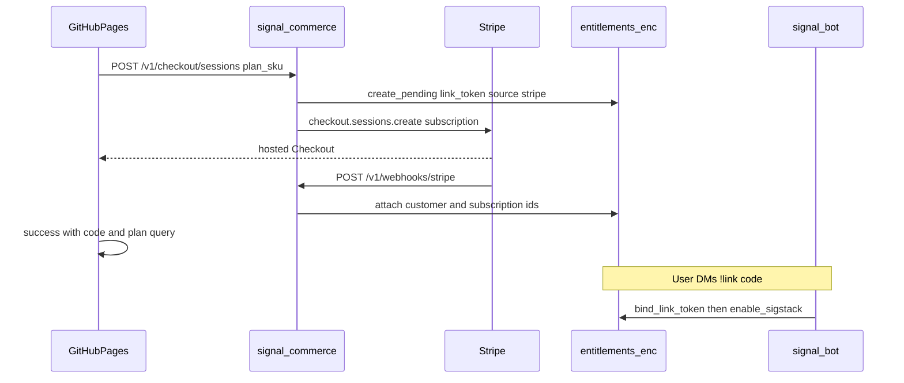

# Decision: Stripe checkout and webhooks on the CVM (commerce sidecar)

Status: **accepted**  
Date: 2026-09-22  
Tracker: [`.agents/docs/github-work-index.md`](../../.agents/docs/github-work-index.md) (Stripe hosting decision + checkout / webhooks / Phala deploy rows)

## Context

The marketing storefront [`site/`](../../site/) is static GitHub Pages. It cannot hold Stripe secret keys or receive webhooks. Paid access is enforced from TEE-encrypted [`entitlements.enc`](../one-cvm-architecture.md#cvm-storage-keep-intact) on the live Phala CVM after users `!link` a pending token.

Catalog (post all-access packs):

| `plan_sku` | Amount | `max_groups` |
|------------|--------|--------------|
| `all-access-3` | $10/mo | 3 |
| `all-access-10` | $25/mo | 10 |
| `bundle-all-alpha` | Free (codes) | Unlimited — **no** Stripe Product |

See [`docs/commerce/stripe-catalog.md`](../commerce/stripe-catalog.md).

## Decision

**Option A — CVM commerce sidecar.** Add an HTTPS service (`signal-commerce`) in [`docker/phala.yaml`](../../docker/phala.yaml) beside `signal-bot`. That service:

1. Creates Stripe Checkout Sessions (`mode: subscription`) from `plan_sku`
2. Receives Stripe webhooks
3. Writes / updates rows in the same `/data/entitlements.enc` volume the bot already uses

GitHub Pages stays the storefront. No Cloudflare Worker, Fly app, or other external Stripe runtime.

**Not chosen:** external serverless only (Option B) or hybrid Checkout-outside / entitlement-write-inside (Option C). Those force a second trust channel to push entitlements into the TEE.

## Sequence



### Locked product / API choices

| Topic | Choice |
|-------|--------|
| Pending mint | `create_pending` **at Checkout Session create** so static success URLs can use `?code=<link_token>&plan=<plan_sku>` ([`site/README.md`](../../site/README.md)) without a Pages→Stripe lookup |
| Checkout | Stripe Checkout Sessions, `mode: subscription`; Price IDs from env (`STRIPE_PRICE_ALL_ACCESS_3` / `_10`) |
| Session metadata | At least `plan_sku` and `link_token` |
| Lifecycle | Webhooks update Stripe IDs and status; `past_due` keeps access for **7 days**, then treat as expired for gating |
| Abandoned sessions | Expire unpaid pending tokens (24–48h TTL) so abandoned Checkouts do not litter the store |
| CORS | Allow the GitHub Pages origin only on `POST /v1/checkout/sessions` |

## Compose / env

Commerce is wired in [`docker/compose.yaml`](../../docker/compose.yaml) and [`docker/phala.yaml`](../../docker/phala.yaml) as `signal-commerce` on **`:8082`**, sharing `group-prefs-translation` → `/data/entitlements.enc` with the bot. Image: `docker/Dockerfile.commerce`. Secrets via `STRIPE_*` / `SITE_*` in [`docker/.phala.env.example`](../../docker/.phala.env.example) (never commit real keys).

## Phala ingress / TLS

Stripe and the browser need a **public HTTPS** URL into the CVM. Precedent: registration proxy on host port `8081`, reached via Phala gateway, e.g.

```text
https://<app-id>-8081.dstack-pha-prod9.phala.network
```

(see [`docs/plans/2026-08-05-phala-deploy-handoff.md`](2026-08-05-phala-deploy-handoff.md)).

Commerce publishes **`8082:8082`**. Expected shapes after deploy (app id is the live translation CVM app composition id):

```text
Health:   https://<app-id>-8082.dstack-pha-prod9.phala.network/health
Checkout: https://<app-id>-8082.dstack-pha-prod9.phala.network/v1/checkout/sessions
Webhook:  https://<app-id>-8082.dstack-pha-prod9.phala.network/v1/webhooks/stripe
```

Ops:

1. Point the Stripe Dashboard webhook endpoint at the webhook URL (test mode first).
2. Store `STRIPE_WEBHOOK_SECRET` (and a restricted `STRIPE_SECRET_KEY`) only in CVM env — never in Pages or git.
3. If the app id / gateway host changes, re-point the Stripe webhook URL.
4. Prefer a stable custom domain later if gateway host churn becomes painful; not required for MVP.

**Why ingress is a real cost:** commerce adds product inbound traffic (Checkout create + Stripe POSTs) into the TEE footprint that already holds Stripe secrets and entitlement writes. That is accepted in exchange for single-deploy trust and direct volume writes.

## Two-writer concurrency

`signal-bot` and `signal-commerce` both mutate `entitlements.enc`. The bot today loads the store at startup into memory. Implementation must:

1. Use a cross-process advisory `flock` around load/persist
2. Reload from disk when the file is newer (`reload_if_stale`) before gate / `!link` / `!enable-sigstack`, plus a low-frequency background reload in the bot
3. Reload-before-write in commerce on every checkout and webhook mutation

## CVM storage (non-negotiable)

- Live CVM: `0e82fa77-8b15-4dbd-89c4-9045ab911353`
- Entitlements stay on **`group-prefs-translation` → `/data/entitlements.enc`** (same volume as group prefs). Do **not** add a separate entitlements volume.
- Upgrades: `phala deploy --cvm-id 0e82fa77-8b15-4dbd-89c4-9045ab911353` only. Do not wipe volumes or replace the CVM for a routine image bump. Details: [`docs/one-cvm-architecture.md` — CVM storage](../one-cvm-architecture.md#cvm-storage-keep-intact).

**Naming:** This is a **commerce HTTP sidecar**, not an in-CVM Whisper sidecar. STT remains NEAR AI Whisper Large V3.

## Related recovery work

Paid rows can still be lost if the prefs/entitlements volume is wiped despite the rules above. Separate ops work covers subscriber backup / Stripe rebuild / cancel-and-notify so customers are not charged for a dead bot — see the work index (subscriber backup row).

## Out of scope for this decision

- Wiring Plans CTAs on Pages (needs the public commerce base URL after deploy)
- Customer Portal proxy (`PUBLIC_STRIPE_PORTAL_URL` stub may remain)
- Live-mode Stripe catalog (seed test Prices first)
- Alpha coexistence beyond existing paid-over-alpha composition

## Success criteria

- Plans can obtain a Checkout URL from the CVM without a second cloud host
- Success page can show a `!link` code that binds after webhook + bot reload
- Subscription cancel / payment failure updates entitlement status with 7-day `past_due` grace
- Live CVM volumes and Signal phone unchanged across commerce deploy
