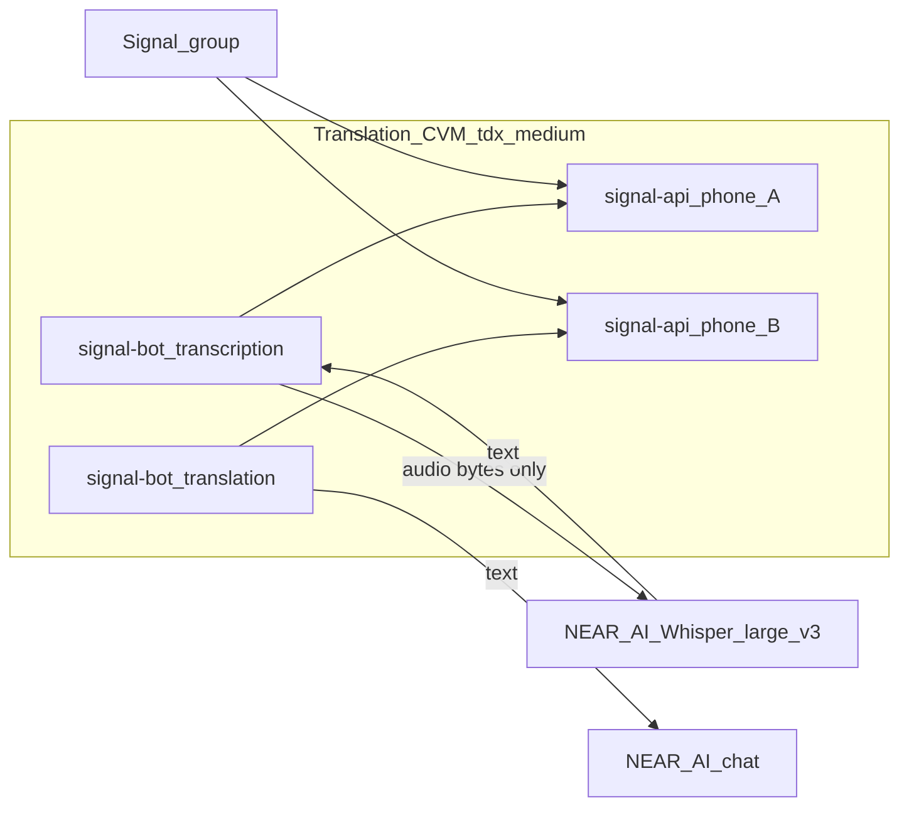

# One CVM, two Signal numbers

Prod runs both products on **one** Phala CVM (today’s translation box). Two phone numbers / two bot processes stay. Signal group chat is still the only coupling between roles — they do not HTTP to each other.

See also: [issue #10](https://github.com/BreadchainCoop/sigstack-bot/issues/10) and the architecture learning [CPU TEE Whisper does not scale](solutions/architecture-patterns/2026-08-13-cpu-tee-whisper-does-not-scale.md).

Local development still uses **two Compose projects** (separate Docker networks) as a mock of two phones.

## Bot hierarchy

In a shared Signal group, users interact with **one hub** and one optional **worker**:

| Role | Phone | Duty |
|------|-------|------|
| **Translation bot** (Bread Bot hub) | Phone B | Product menus (`!help`, `!info`, `!privacy`, `!translation-*`), Language Threads, in-chat translation, pairing (`!transcription` invite), `!verify` (this CVM quote) |
| **Transcription bot** (worker) | Phone A | Voice only: `!transcription`, `!transcribe*`, `!verify` (same CVM, second Signal number). **No hub** — does not answer `!help` / `!info` / `!privacy` |

Signal still delivers every message to both members; the transcription stack **ignores** hub text commands and non-voice work. The translation bot **leads** suite navigation and inviting the transcription peer; the transcription bot **executes** voice→text and its own product toggles.

Hub vs worker command split: [voice-transcription.md](voice-transcription.md#commands-transcription-bot).

## Diagram



## Rules

- **Two phone numbers**, two bots in the group. **Translation = hub manager; transcription = specialized worker** (see [Bot hierarchy](#bot-hierarchy)).
- Signal delivers **all** group messages to every member bot. The transcription bot **receives** text but **ignores** it; it only **acts** on voice. The translation bot receives voice too but only **acts** on text (including transcripts posted by the transcription bot).
- No local Whisper sidecar. Voice audio is decrypted in this TEE, stripped of Signal metadata, and sent to **NEAR AI Whisper Large V3** (GPU TEE). Translation text uses the same vendor.
- Keep two bot **processes** so a voice note in flight (HTTP wait to NEAR Whisper) cannot stall translation polling.
- Same `signal-bot` image; role selected by `BOT__ROLE=transcription|translation`.
- Do not reintroduce `whisper-api` or put Whisper on a larger CPU TEE as the scale path.

## Local dual stack (mock two phones)

```bash
cp docker/transcription.env.example docker/transcription.env
cp docker/translation.env.example docker/translation.env
# Set two different SIGNAL_PHONE values; NEAR_AI_API_KEY in both (STT + chat)

docker compose -f docker/compose.transcription.yaml --env-file docker/transcription.env up -d
docker compose -f docker/compose.translation.yaml --env-file docker/translation.env up -d

docker network ls | grep sigstack
# Expect: sigstack-transcription-internal and sigstack-translation-internal
```

Register each number against its own stack’s `signal-api` (e.g. `docker compose … exec signal-api curl …`). Translation compose also exposes the registration proxy on host port `8081`.

E2E still needs two registered Signal numbers in a shared test group. Dual compose mocks **two phones**, not two Phala CVMs.

## Phala (prod)

| Compose | CVM | Contents |
|---------|-----|----------|
| [`docker/phala.translation.yaml`](../docker/phala.translation.yaml) | 4 GB (`tdx.medium`) | `signal-api` (phone B) + `signal-api-transcription` (phone A) + two `signal-bot` + proxies `:8081` / `:8082`. **No Whisper sidecar.** |
| [`docker/phala.transcription.yaml`](../docker/phala.transcription.yaml) | — | **Deprecated stub.** Do not deploy. |

Live CVM: `sigstack-translation` **`0e82fa77-8b15-4dbd-89c4-9045ab911353`** (app `9adac7636fe255182f699940ffd1924960415507`). The former transcription CVM `eba19afc-0c26-4409-b026-f757928d2ef8` was deleted (idle Whisper bill).

Upgrade **in place** only:

```bash
phala deploy --cvm-id 0e82fa77-8b15-4dbd-89c4-9045ab911353 \
  -c docker/phala.translation.yaml -e docker/phala.translation.env --wait
```

[`scripts/deploy_phala.sh`](../scripts/deploy_phala.sh) defaults to that `--cvm-id`. Do not `phala deploy -n` against the live CVM.

Phone A must be **re-registered** on proxy `:8082` after the first one-CVM merge (that session died with the deleted CVM). Phone B on `:8081` stays.

### CVM storage (keep intact)

The suite stays cohesive only if the live CVM keeps disk state. **TEE RAM is wiped** on every restart or upgrade; that is expected. User prefs and Signal identity are **not** in RAM — they live on named Docker volumes that Phala reattaches on an in-place upgrade.

| Volume | Compose | What it holds | If wiped |
|--------|---------|---------------|----------|
| `signal-config-translation` | `signal-api` (phone B) | Translation bot **registered Signal phone** | Hub disappears from Signal until ops re-register |
| `signal-config-transcription` | `signal-api-transcription` (phone A) | Transcription bot session | Voice worker gone until re-register (expected empty after first merge) |
| `group-prefs-translation` | translation `signal-bot` → `/data/group_prefs.enc` | Encrypted prefs: `!translate-me-on`, `!translate-all-on`, Language Threads bridges, menu language | Users must re-enable features |
| `group-prefs-transcription` | transcription `signal-bot` → `/data/group_prefs.enc` | Encrypted `!transcribe-on` prefs | Users must re-enable auto transcribe |
| `registry-data` / `registry-data-transcription` | registration proxies | Ops registration helper state | Re-register via proxy; does not by itself drop Signal CLI |

**Upgrade the live CVM in place** (`phala deploy --cvm-id 0e82fa77-8b15-4dbd-89c4-9045ab911353` or the dashboard compose update). Do **not** create a replacement CVM, rename `signal-config-translation` / `group-prefs-translation` / `registry-data`, or `down -v` for a routine image bump. First bring-up of a **new** CVM is the exception (empty volumes; register phones there).

| Event | Volumes | Users re-enable prefs? | Re-register phones? |
|-------|---------|------------------------|---------------------|
| In-place CVM upgrade (`--cvm-id`) | Kept (Phala reattaches) | No | No (phone A only if that volume was new/empty) |
| Container / CVM restart, same compose | Kept | No | No |
| New CVM / `phala cvms delete` / volume rename | Empty | Yes | Yes |
| Prefs decrypt fail (key mismatch) | File present, unreadable | Yes (bot starts empty) | No (Signal volume is separate) |

Prefs are encrypted with dstack `DeriveKey` (path `signal-bot/group-preferences`), bound to the CVM **app id**, so a compose/image change should still decrypt. If DeriveKey is unavailable the AppInfo fallback includes `compose_hash` — a compose change then fails decrypt. After upgrade, logs should show `Loaded group preferences for N groups`, not `starting fresh` or `TEE deployment may have changed`. Confirm Signal accounts still listed on each `signal-api`.

Do not change volume names in [`docker/phala.translation.yaml`](../docker/phala.translation.yaml) without a deliberate migration.

## Products on this CVM

| Product | Bot process | Doc |
|---------|-------------|-----|
| Voice transcription | Transcription | [voice-transcription.md](voice-transcription.md) |
| In-chat (group) translation | Translation | [in-chat-translation.md](in-chat-translation.md) |
| Language Threads | Translation | [language-threads.md](language-threads.md) |

### Interoperability

- **Transcription** (worker) composes with translation products in the same group. The **translation bot** invites via `!transcription` and posts the voice menu after invite; the **transcription bot** runs voice and answers `!transcription` when already paired.
- **In-chat** translates inside one group thread (quote-reply).
- **Language Threads** bridges a multilingual main to N monolingual sidecars (`!translate-me-thread`).

## Why two processes (not two CVMs)

The old split existed to isolate **CPU Whisper** from translation. That is obsolete: STT is remote GPU. Two CVMs did not make ~5s notes usable and billed a second `tdx.medium` idle. Two **processes** on one CVM still matter — translation must not await STT in a single serial dispatch loop. Do not merge roles into one bot in this architecture.
