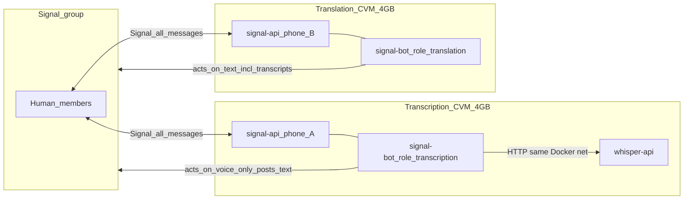

# Two-CVM architecture

Product suite split across two Phala CVMs (and two local Docker Compose projects). Signal group chat is the only cross-stack bus.

See also: [issue #10](https://github.com/BreadchainCoop/sigstack-bot/issues/10).

## Bot hierarchy

In a shared Signal group, users interact with **one hub** and one optional **worker**:

| Role | Phone | Duty |
|------|-------|------|
| **Translation bot** (Bread Bot hub) | Phone B | Product menus (`!help`, `!info`, `!privacy`, `!translation-*`), Language Threads, in-chat translation, pairing (`!transcription` invite), `!verify` (translation CVM quote) |
| **Transcription bot** (worker) | Phone A | Voice only: `!transcription`, `!transcribe*`, `!verify` (transcription CVM quote). **No hub** — does not answer `!help` / `!info` / `!privacy` |

Signal still delivers every message to both members; the transcription stack **ignores** hub text commands and non-voice work. The translation bot **leads** suite navigation and inviting the transcription peer; the transcription bot **executes** voice→text and its own product toggles.

Hub vs worker command split: [voice-transcription.md](voice-transcription.md#commands-transcription-bot).

## Diagram



## Rules

- **Two phone numbers**, two bots in the group. **Translation = hub manager; transcription = specialized worker** (see [Bot hierarchy](#bot-hierarchy)).
- Signal delivers **all** group messages to every member bot. The transcription bot **receives** text but **ignores** it; it only **acts** on voice. The translation bot receives voice too but only **acts** on text (including transcripts posted by the transcription bot).
- No cross-CVM Docker/HTTP link. Whisper stays **inside** the transcription stack only.
- Same `signal-bot` image; role selected by `BOT__ROLE=transcription|translation`.

## Local dual stack (mock prod)

```bash
cp docker/transcription.env.example docker/transcription.env
cp docker/translation.env.example docker/translation.env
# Set two different SIGNAL_PHONE values; set NEAR_AI_API_KEY in translation.env

docker compose -f docker/compose.transcription.yaml --env-file docker/transcription.env up -d
docker compose -f docker/compose.translation.yaml --env-file docker/translation.env up -d

docker network ls | grep sigstack
# Expect: sigstack-transcription-internal and sigstack-translation-internal
```

Register each number against its own stack’s `signal-api` (e.g. `docker compose … exec signal-api curl …`). Translation compose also exposes the registration proxy on host port `8081`.

E2E still needs two registered Signal numbers in a shared test group. Dual compose mocks **isolation and resource split**, not Signal itself.

## Phala (prod)

| Compose | CVM | Contents |
|---------|-----|----------|
| [`docker/phala.transcription.yaml`](../docker/phala.transcription.yaml) | 4 GB (`tdx.medium`) | `signal-api` + `whisper-api` + `signal-bot` (`BOT__ROLE=transcription`) |
| [`docker/phala.translation.yaml`](../docker/phala.translation.yaml) | 4 GB (`tdx.medium`) | `signal-api` + `signal-bot` (`BOT__ROLE=translation`) + registration proxy |

Deploy each compose to its **own** CVM. Do not co-locate Whisper with the translation bot.

## Products on each CVM

| Product | CVM | Doc |
|---------|-----|-----|
| Voice transcription | Transcription | [voice-transcription.md](voice-transcription.md) |
| In-chat (group) translation | Translation | [in-chat-translation.md](in-chat-translation.md) |
| Language Threads | Translation | [language-threads.md](language-threads.md) |

### Interoperability

- **Transcription** (worker CVM) composes with translation products in the same group. The **translation bot** invites via `!transcription` and posts the voice menu after invite; the **transcription bot** runs voice and answers `!transcription` when already paired.
- **In-chat** translates inside one group thread (quote-reply).
- **Language Threads** bridges a multilingual main to N monolingual sidecars (`!translate-me-on`).

## Why split

Transcription (Whisper) is latency- and memory-heavy. Keeping it on a separate CVM prevents long voice jobs from queuing behind translation traffic for users who only subscribe to translation.
